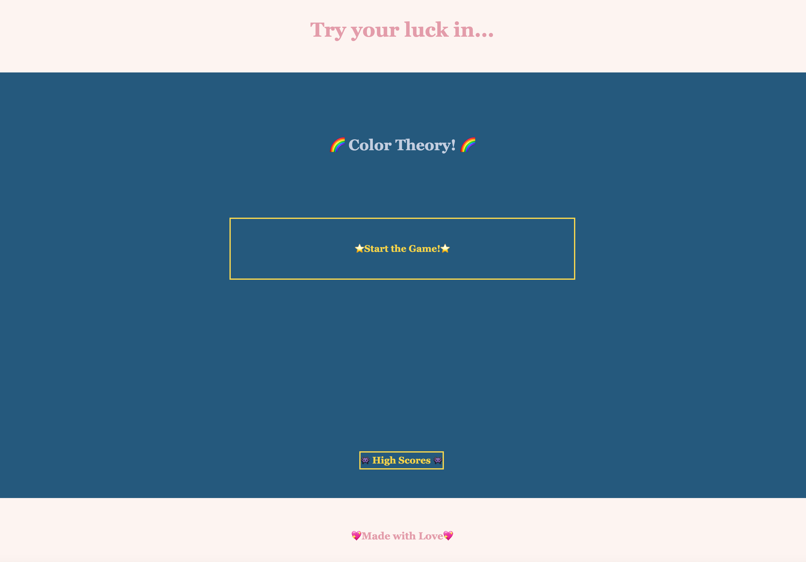

# Pop-Quizzin-Color-Theory
<h1>Screenshots</h1>

<h1>Description</h1>
This project was intended to display a series of quiz questions and answers, using HTML, CSS, and JS elements. 

Together, these 3 items should make a functional and well-working quiz-page. (Or in this case, multiple quiz pages.)

<h1>Credits</h1>
Big love to all of those in my study groups, and especially to Noah, who did his best to help break down certain processes with me.

And of course, to the TAs who put up with my silly questions this assignment.

<h1> Licensing </h1>
Standard Licensings apply, however, feel free to pull the code -- please, just ask prior to. Thank you (-:

<h1> Deployed Link </h1>
